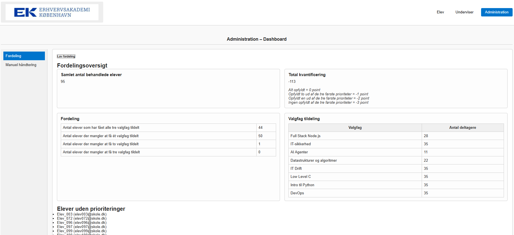
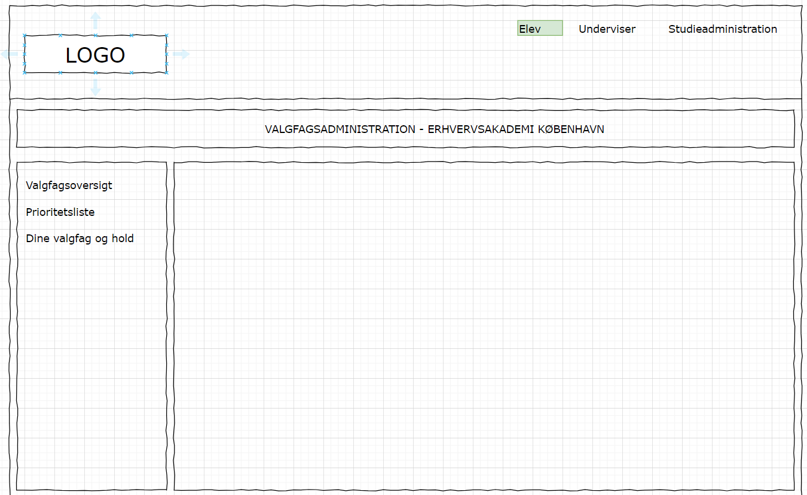
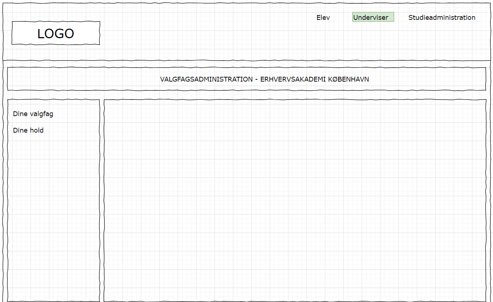
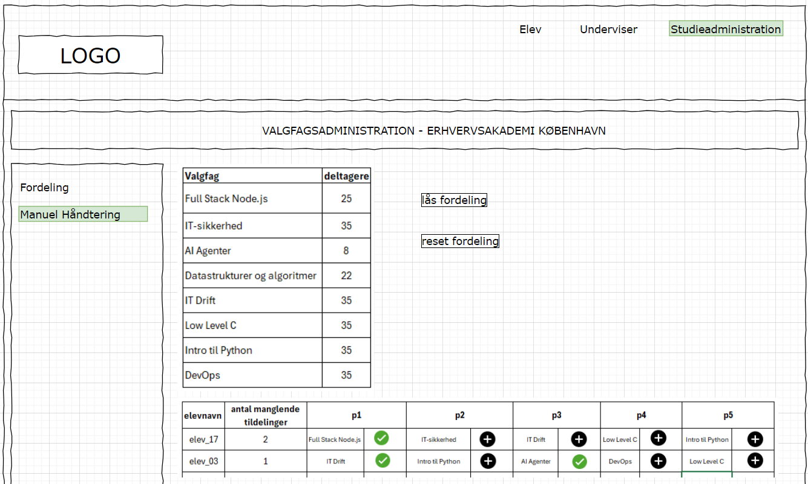

# Vejledning - opsætning af database og environment variables
Jeg har tilknyttet en database (MySql) til min applikation.

For at kunne køre applikationen og Jpa kan generere TABLES ud fra Entities, så skal du først oprette en database. Kald den gerne *valgfagsfordelingdb* (så kan insert script køres uden problemer). 

Opret følgende environment variables i din IDE:

**DB_URL**

**DB_USER**

**DB_PASS**

Kør herefter applikationen, så tabeller og afhængigheder oprettes.

Her nedenstående ses et ER diagram over databasen (reversed engineered fra MySql):

Jeg har fået genereret noget DUMMY data (AI). Kør dette script for at fylde i databasen: [INSERT - dummy data](./scripts/INSERT_SCRIPT_DUMMY_DATA.sql)

# Applikationen
Almindeligvis vil jeg i et fullstack-projekt have backend i et repository og frontend i sin egen, men grundet projektets størrelse har jeg valgt at køre det hele i samme projekt. 
Selve frontend delen af applikationen må jeg indrømme, at jeg ikke har brugt den store energi på, og grundet manglende tid har jeg heller ikke fået færdiggjort alle de forskellige pages / wireframes, som jeg havde en intention om fra starten. 
Mit fokus har været på Studieadministrations siden, da det er denne som igangsætter algoritmen og viser output.

Når du kører applikation og går ind på http://localhost:8080/, så kommer du ind på en ret blank landingpage, hvor du i nav-bar har mulighed for at vælge mellem Elev - Underviser - Administration. 

I "produktion" skulle der indarbejdes login med authentication og authorization, så de forskellige brugerprofiler kun har adgang til det de skal have.

Hvis du vælger **Administration** og har indlæst DUMMY data, så kan du trykke på knappen - **Lav fordeling** - hvorefter fordelingsalgoritmen kører, og du vil kunne se: 
- Samlet antal behandlede elever (det er dem, som har lavet prioritering)
- Kvantificering i forhold til opfyldelse af de øverste prioriteter. Jo tættere på nul jo bedre er tallet (jo flere har fået opfyldt deres øverste prioriteter)
- Data i forhold til hvor mange, der har fået alle deres tre valgfag tildelt og hvor mange der mangler et eller flere tildelinger
- Hvor mange elever der er fordelt pr valgfag ved tildelingen
- Samt en liste over dem der ikke har lavet prioriteringer. De skal håndteres manuelt efterfølgende sammen med dem, der mangler at få tildelt nogle valgfag.

Du kan køre denne tildelingen igen og igen, hvorved du kan se tallene ændrer sig.

Tanken var at indarbejde en form for "lås tildeling" feature, når den ønskede tildeling var opnået. 

Herefter skulle fanen **Manuel håndtering** hjælpe studieadministrationen videre med en oversigt over dem der manuelt skal have valgfag tildelt, og en nem mulighed for at gøre dette (se nede i wireframe skitse).

Her nedenstående er nogle af mine opstartsskitser i forhold til wireframes:

